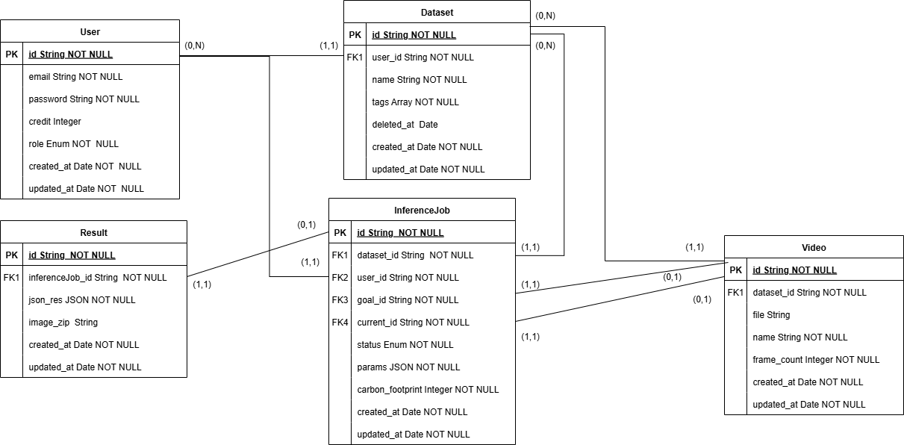

# Database & Models Documentation

## Database Structure
### Entity / Relationship Diagram

  

### Main Tables

#### 1. User

- **id**: UUID (Primary Key)
- **email**: String, unique, required, validated as email
- **password**: String, required (stored encrypted)
- **role**: Enum ('user', 'admin'), required
- **credit**: Integer, default 100, min 0
- **created_at**: Date, auto-populated
- **updated_at**: Date, auto-populated

#### 2. Dataset

- **id**: UUID (Primary Key)
- **user_id**: UUID (Foreign Key → User.id)
- **name**: String, required
- **tags**: Array of strings, default []
- **deleted_at**: Date (nullable, for soft delete)
- **created_at**: Date, auto-populated
- **updated_at**: Date, auto-populated
- **Constraints**: Unique constraint on (user_id, name) where deleted_at is null

#### 3. Video

- **id**: UUID (Primary Key)
- **dataset_id**: UUID (Foreign Key → Dataset.id)
- **file**: String (path to video file), nullable
- **name**: String, required
- **frame_count**: Integer, required
- **created_at**: Date, auto-populated
- **updated_at**: Date, auto-populated

#### 4. InferenceJob

- **id**: UUID (Primary Key)
- **dataset_id**: UUID (Foreign Key → Dataset.id)
- **user_id**: UUID (Foreign Key → User.id)
- **goal_id**: UUID (Foreign Key → Video.id)
- **current_id**: UUID (Foreign Key → Video.id)
- **status**: Enum ('PENDING', 'RUNNING', 'FAILED', 'ABORTED', 'COMPLETED'), default 'PENDING'
- **params**: JSON (inference parameters)
- **carbon_footprint**: Integer, default 0
- **created_at**: Date, auto-populated
- **updated_at**: Date, auto-populated

#### 5. Result

- **id**: UUID (Primary Key)
- **inferenceJob_id**: UUID (Foreign Key → InferenceJob.id, unique)
- **json_res**: JSON (inference results)
- **image_zip**: String (path to ZIP file), nullable
- **created_at**: Date, auto-populated
- **updated_at**: Date, auto-populated

## Relationships

### One-to-Many

- **User → Datasets**: A user can have multiple datasets
- **User → InferenceJobs**: A user can have multiple inference jobs
- **Dataset → Videos**: A dataset can contain multiple videos
- **Dataset → InferenceJobs**: A dataset can have multiple inference jobs
- **Video → InferenceJobs (as goal)**: A video can be the goal for multiple inference jobs
- **Video → InferenceJobs (as current)**: A video can be the current for multiple inference jobs

### One-to-One

- **InferenceJob → Result**: An inference job has at most one result

## Test Data

The seeders include:

- **Users**: 1 admin with 100,000 credits, 4 regular users with 100 credits each, plus 100 random users
- **Datasets**: Multiple datasets per user with random names and tags
- **Videos**: One video per dataset with random names and 1500 frames each
- **InferenceJobs**: One job per video with random status
- **Results**: One result per inference job with mock detection data

## System Costs

According to the project specifications:

- **Upload video**: 0.001 credit per frame
- **Inference**: 0.002 credits per processed frame

The system checks the available credits before allowing expensive operations.

## Implementation Notes

- All models use UUID as primary keys for greater security
- Datasets support soft delete (deleted_at) with paranoid mode enabled
- Video files are stored as paths to the filesystem
- Result ZIP files are stored as paths to the filesystem
- All relationships are managed through foreign keys with CASCADE
- Timestamps are automatically managed with created_at and updated_at fields
- Inference parameters are stored as JSON

## Database Connection

The database connection is managed through a singleton Database class that provides a Sequelize instance. The connection parameters are loaded from environment variables.

## Workflow to Interact with DB Objects

Controller → Service → Repository → DAO → Database
