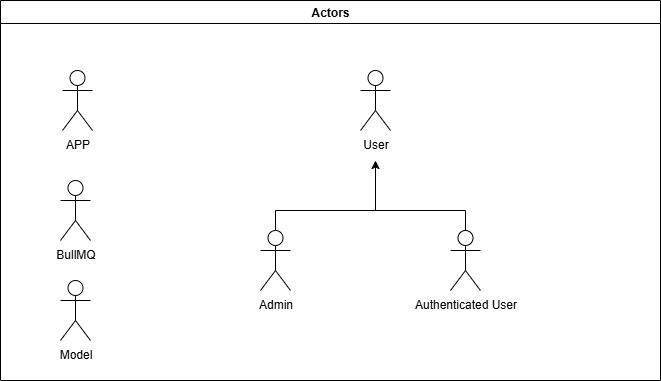
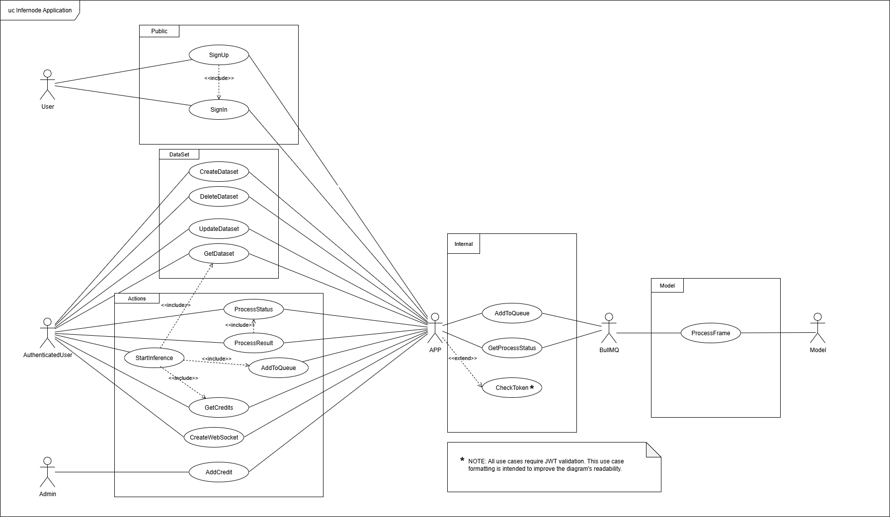
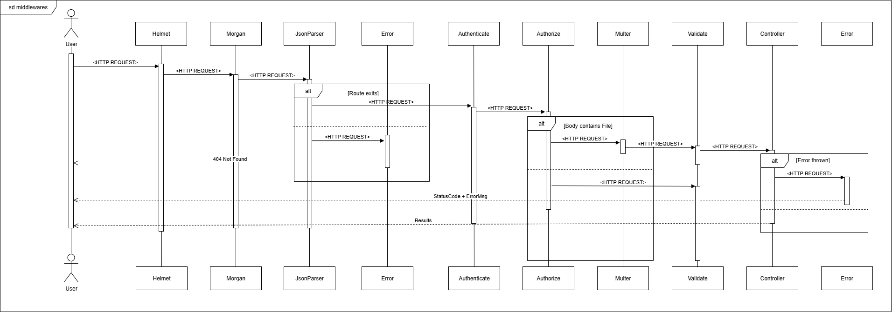
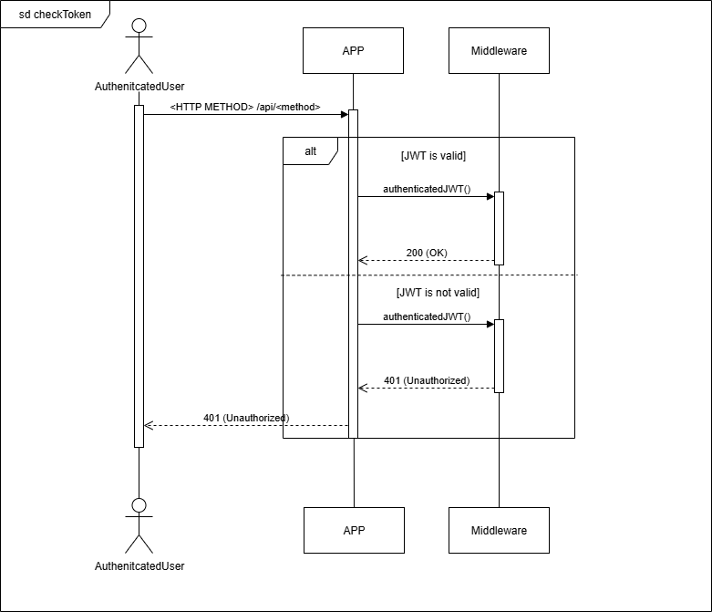
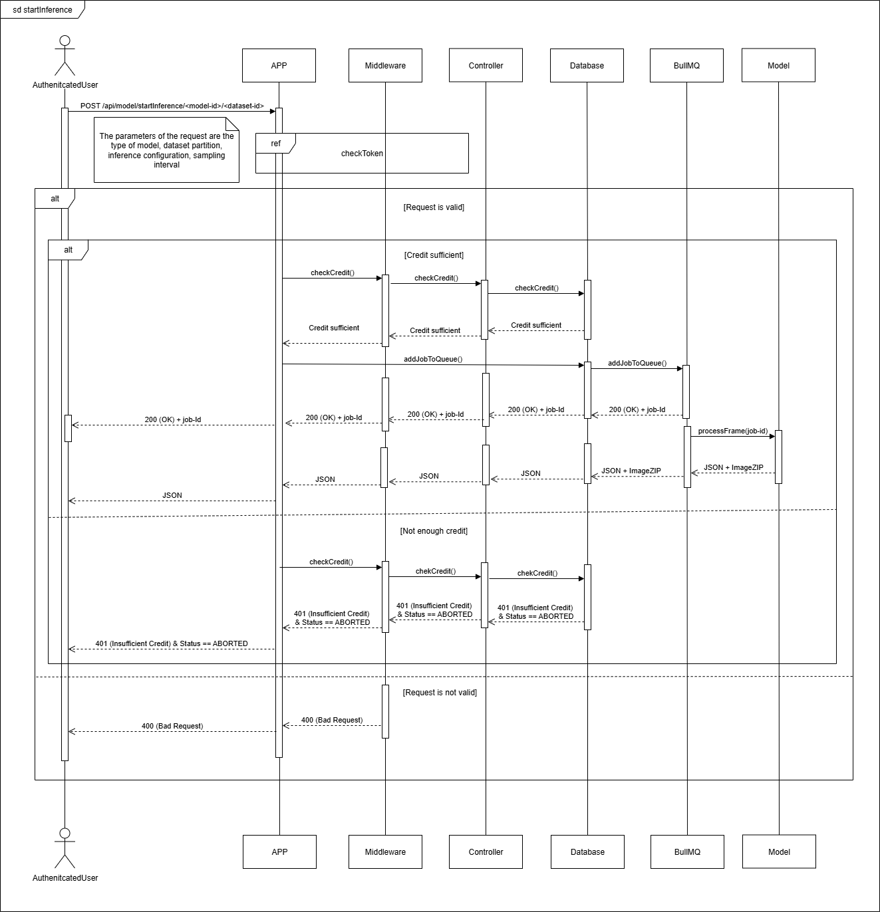
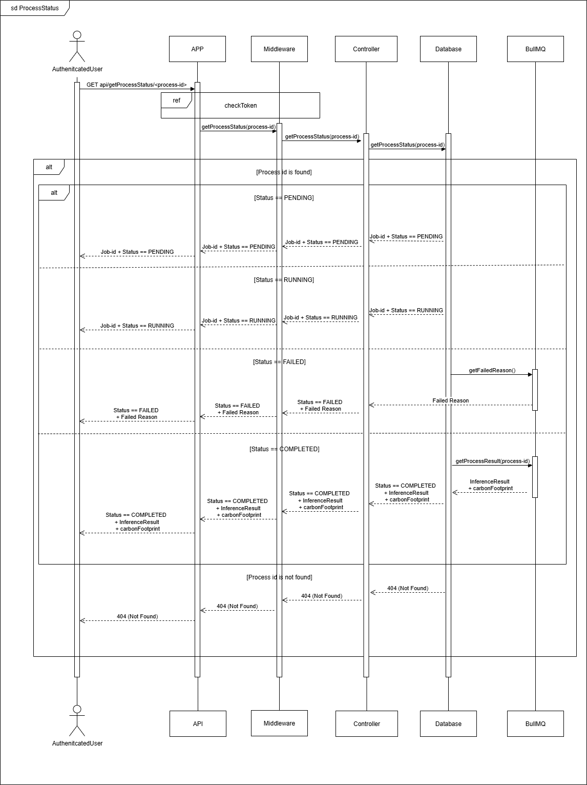

# InferNode - Node Backend for FastCNS

<div style="height:200px; overflow:hidden; margin:auto;" align="center">
  
</div>

> _"I can see it... the code." - Neo, The Matrix (1999)_

<div align="center">
  <sub>Built with ❤️ and probably too much caffeine</sub>
</div>
<br><br>

[](https://www.docker.com/)
[](https://docs.docker.com/compose/)
[](https://eslint.org/)
[](https://expressjs.com/)
[](https://fastapi.tiangolo.com/)
[](https://github.com/)
[](https://developer.mozilla.org/en-US/docs/Web/JavaScript)
[](https://jestjs.io/)
[](https://jwt.io/)
[](https://www.json.org/)
[](https://nodejs.org/)
[](https://www.npmjs.com/)
[](https://www.postgresql.org/)
[](https://www.postman.com/)
[](https://prettier.io/)
[](https://www.python.org/)
[](https://pytorch.org/)
[](https://redis.io/)
[](https://sequelize.org/)
[](https://swagger.io/)
[](https://www.typescriptlang.org/)
[](https://code.visualstudio.com/)

# Introduction

InferNode is a Node.js backend service designed for running inferences on CNS (Correspondence Encoded Neural Image Servo Policy) model. It provides a comprehensive API for managing datasets, videos, and inference jobs with a focus on performance and security.

# Features

- **User Authentication & Authorization**
  - JWT-based authentication with RS256 algorithm
  - Role-based access control (User/Admin)
  - Encrypted passwords using bcrypt

- **Dataset Management**
  - Create, read, update, and delete datasets
  - Tag-based organization
  - Soft deletion support

- **Video Processing**
  - Upload and manage videos and zip within datasets
  - Automatic frame counting
  - File system storage with database references

- **Inference Jobs**
  - Queue-based processing with BullMQ
  - Real-time status updates via WebSockets
  - Carbon footprint tracking

- **Results Management**
  - JSON results storage
  - ZIP file management for image outputs

- **API Documentation**
  - Swagger UI for interactive API exploration
  - Comprehensive OpenAPI specification

- **Monitoring & Debugging**
  - Bull Board for queue monitoring
  - Detailed logging with Winston
  - Health check endpoints

- **Data Validation Middleware**
  - Structured data validation patterns

- **Git Hooks with Husky and Conventional Commits**
  - The project leverages Husky to automate code quality enforcement through Git hooks
  - Pre-commit hooks automatically run:
    - ESLint for static code analysis and error detection
    - Prettier for consistent code formatting across the codebase
    - Commit message validation to ensure they follow conventional commit format
  - This ensures all code meets quality standards before being committed
  - Prevents bad commits from entering the codebase
  - Maintains consistent code style and commit history
  - Reduces code review friction by catching issues early

    ### Commit types
    - feat: A new feature
    - fix: A bug fix
    - docs: Documentation changes
    - style: Code style changes (formatting, etc)
    - refactor: Code changes that neither fix bugs nor add features
    - perf: Performance improvements
    - test: Adding or modifying tests
    - chore: Changes to build process or auxiliary tools
    - ci: Changes to CI configuration files and scripts

# Technology Stack

- **Backend**: Node.js, Express, TypeScript
- **Database**: PostgreSQL, Sequelize ORM
- **Authentication**: JWT with RS256
- **Queue Management**: Redis, BullMQ, Bull Dashboard
- **Real-time Communication**: WebSockets
- **Inference**: Torch, FastAPI
- **Containerization**: Docker, Docker Compose
- **Documentation**: Swagger/OpenAPI
- **Testing**: Jest

# Installation

## Prerequisites

You only need a docker engine to run this project!

### Locally running

- Node.js 18+ (for local development) with TypeScript
- npm or yarn

## Environment Setup

Create, or copy from `.env.example`, a `.env` file in the root directory with the following variables:

```env
## Content of .env.example
# InferNode API Configurations
API_PORT=3000
NODE_ENV=development

# CNS Configurations
FASTAPI_HOST=cns
FASTAPI_PORT=8000

# Redis Configuration
REDIS_HOST=redis
REDIS_PORT=6379

#PostgreSQL Configuration
POSTGRES_USER=admin
POSTGRES_PASSWORD=admin
POSTGRES_DB=db
POSTGRES_PORT=5432
POSTGRES_HOST=postgres

# JWT Configuration
JWT_PRIVATE_KEY_PATH=./keys/private.key
JWT_PUBLIC_KEY_PATH=./keys/public.key
JWT_EXPIRES_IN=1h
JWT_ALGORITHM=RS256

# Number of salt rounds for bcrypt hashing
SALT_ROUNDS=12
```

## Generate JWT Keys

Keys are automatically generated when the container is started.
If for any reason you need to regenerate, you can run the following:

```bash
docker exec -it infernode-app npm run keys
# or
docker exec -it infernode-app npm run keys --force # to force generation
```

when container is already running.

## Docker Setup

### First Launch or Rebuild

```bash
docker compose up --build
# or for detached mode
docker compose up --build -d
```

### Subsequent Launches

```bash
docker compose up
# or for detached mode
docker compose up -d
```

## Development Setup

The Docker configuration mounts `src` and `tsconfig.json` as volumes, so changes to these files are automatically synced to the container. Changes to other files require a rebuild.

### Adding/Removing Packages on the fly

```bash
docker exec -it infernode-app npm install package-name
docker exec -it infernode-app npm uninstall package-name
```

# API Documentation

Complete API documentation is available at `/api/docs` when the server is running. It provides an interactive interface to explore all endpoints, request/response formats, and authentication requirements.

## API Reference

### Authentication

- **POST `/api/auth/register`**: Register a new user
  - Body: Email and password
  - Example Request:
    ```json
    {
      "email": "user@example.com",
      "password": "securepassword123"
    }
    ```
  - Example Response:
    ```json
    {
      "message": "User registered successfully",
      "user": {
        "id": "550e8400-e29b-41d4-a716-446655440000",
        "email": "user@example.com",
        "role": "user",
        "credit": 100
      }
    }
    ```

- **POST `/api/auth/login`**: Authenticate user and get JWT token
  - Body: Email and password
  - Example Request:
    ```json
    {
      "email": "user@example.com",
      "password": "securepassword123"
    }
    ```
  - Example Response:
    ```json
    {
      "message": "Login successful",
      "token": "eyJhbGciOiJSUzI1NiIsInR5cCI6IkpXVCJ9..."
    }
    ```

### User Management

- **GET `/api/user/credits`**: Get current user's credit balance
  - Auth: Bearer token required
  - Returns: Credit amount
  - Example Response:
    ```json
    {
      "credits": 100
    }
    ```

- **POST `/api/admin/recharge`**: Add credits to a user's account (Admin only)
  - Auth: Bearer token required (Admin role)
  - Body: Email and credit amount
  - Example Request:
    ```json
    {
      "email": "user@example.com",
      "credits": 50
    }
    ```
  - Example Response:
    ```json
    {
      "message": "User's credits updated",
      "newBalance": 150
    }
    ```

### Dataset Management

- **POST `/api/dataset`**: Create a new dataset
  - Auth: Bearer token required
  - Body: Name and optional tags
  - Example Request:
    ```json
    {
      "name": "Traffic Analysis 2023",
      "tags": ["traffic", "urban", "peak-hours"]
    }
    ```
  - Example Response:
    ```json
    {
      "message": "Dataset created successfully",
      "dataset": {
        "id": "550e8400-e29b-41d4-a716-446655440000",
        "user_id": "7f8d0a15-8e1c-4612-a30c-1a2b3c4d5e6f",
        "name": "Traffic Analysis 2023",
        "tags": ["traffic", "urban", "peak-hours"],
        "created_at": "2023-07-15T10:30:00.000Z",
        "updated_at": "2023-07-15T10:30:00.000Z"
      }
    }
    ```

- **GET `/api/dataset`**: Get all user's datasets
  - Auth: Bearer token required
  - Optional: Tag filters
  - Example URL with query parameters:
    ```
    /api/dataset?tags=traffic&tags=urban
    ```
  - Example Response:
    ```json
    {
      "datasets": [
        {
          "id": "550e8400-e29b-41d4-a716-446655440000",
          "name": "Traffic Analysis 2023",
          "tags": ["traffic", "urban", "peak-hours"],
          "created_at": "2023-07-15T10:30:00.000Z"
        },
        {
          "id": "7f8d0a15-8e1c-4612-a30c-1a2b3c4d5e6f",
          "name": "Urban Mobility Study",
          "tags": ["traffic", "urban"],
          "created_at": "2023-07-20T14:15:00.000Z"
        }
      ]
    }
    ```

- **GET `/api/dataset/{id}`**: Get dataset by ID
  - Auth: Bearer token required
  - Example Response:
    ```json
    {
      "dataset": {
        "id": "550e8400-e29b-41d4-a716-446655440000",
        "name": "Traffic Analysis 2023",
        "tags": ["traffic", "urban", "peak-hours"],
        "created_at": "2023-07-15T10:30:00.000Z",
        "updated_at": "2023-07-15T10:30:00.000Z",
        "videos": [
          {
            "id": "a1b2c3d4-e5f6-4a5b-8c7d-9e8f7a6b5c4d",
            "name": "Morning Rush Hour",
            "frame_count": 1500
          }
        ]
      }
    }
    ```

- **PUT `/api/dataset/{id}`**: Update dataset
  - Auth: Bearer token required
  - Body: Updated name and/or tags
  - Example Request:
    ```json
    {
      "name": "Traffic Analysis 2023 - Updated",
      "tags": ["traffic", "urban", "peak-hours", "analysis"]
    }
    ```
  - Example Response:
    ```json
    {
      "message": "Dataset updated successfully",
      "dataset": {
        "id": "550e8400-e29b-41d4-a716-446655440000",
        "name": "Traffic Analysis 2023 - Updated",
        "tags": ["traffic", "urban", "peak-hours", "analysis"],
        "updated_at": "2023-07-16T08:45:00.000Z"
      }
    }
    ```

- **DELETE `/api/dataset/{id}`**: Delete dataset (soft delete)
  - Auth: Bearer token required
  - Example Response:
    ```json
    {
      "message": "Dataset 550e8400-e29b-41d4-a716-446655440000 deleted successfully"
    }
    ```

- **POST `/api/dataset/{id}/videos`**: Upload video to dataset
  - Auth: Bearer token required
  - Content-Type: multipart/form-data
  - Body: File content, name, and type
  - Example Form Data:
    ```
    content: [binary file data]
    name: "Morning Rush Hour"
    type: "video"
    ```
  - Example Response:
    ```json
    {
      "message": "Morning Rush Hour - video added",
      "id": "a1b2c3d4-e5f6-4a5b-8c7d-9e8f7a6b5c4d",
      "costDeducted": 10
    }
    ```

### Inference Jobs

- **POST `/api/inference`**: Create and enqueue inference job
  - Auth: Bearer token required
  - Body: Dataset ID, parameters, and range
  - Example Request:
    ```json
    {
      "datasetId": "550e8400-e29b-41d4-a716-446655440000",
      "parameters": {
        "startFrame": 0,
        "endFrame": 500,
        "goalFrameId": 40,
        "frameStep": 2,
        "detector": "SIFT",
        "useGpus": true
      },
      "range": "all"
    }
    ```
  - Example Response:
    ```json
    {
      "jobId": ["7f8d0a15-8e1c-4612-a30c-1a2b3c4d5e6f"]
    }
    ```

- **GET `/api/inference/status/{id}`**: Get job status
  - Auth: Bearer token required
  - Returns: Current status
  - Example Response:
    ```json
    {
      "status": "RUNNING"
    }
    ```

- **GET `/api/inference/result/json/{id}`**: Get job results as JSON
  - Auth: Bearer token required
  - Returns: Results data
  - Example Response:
    ```json
    {
      "results": {
        "requestId": "7f8d0a15-8e1c-4612-a30c-1a2b3c4d5e6f",
        "velocity": [
          [0.1, 0.2],
          [0.3, 0.4],
          [0.5, 0.6]
        ],
        "carbon_footprint": 25,
        "download_url": "/download/results/7f8d0a15-8e1c-4612-a30c-1a2b3c4d5e6f.zip",
        "message": "Inference completed successfully"
      }
    }
    ```

- **GET `/api/inference/result/zip/{id}`**: Get job results as ZIP file
  - Auth: Bearer token required
  - Returns: ZIP file binary data
  - Note: This endpoint returns a binary file download, not JSON

### WebSocket

- **GET `/api/websocket/stats`**: Get WebSocket connection statistics
  - Auth: Bearer token required
  - Returns: Connection statistics
  - Example Response:
    ```json
    {
      "success": true,
      "data": {
        "totalConnections": 5,
        "userConnections": 2
      }
    }
    ```

- **POST `/api/websocket/test`**: Send test notification
  - Auth: Bearer token required
  - Body: Message content
  - Example Request:
    ```json
    {
      "message": "This is a test notification"
    }
    ```
  - Example Response:
    ```json
    {
      "success": true,
      "message": "Test notification sent"
    }
    ```

### Health Check

- **GET `/api/health`**: Check if server is running
  - Returns: Status and timestamp
  - Example Response:
    ```json
    {
      "status": "Server is working!",
      "timestamp": "2023-07-15T14:22:10.123Z"
    }
    ```

# Database Structure

The application uses PostgreSQL with the following main tables:

- **User**: Authentication and authorization
- **Dataset**: Collections of videos with tags
- **Video**: Video files with metadata
- **InferenceJob**: Processing jobs with status tracking
- **Result**: Outputs from inference jobs

For detailed database documentation, see [DATABASE_DOC.md](./DATABASE_DOC.md).

# Architecture & Design Patterns

InferNode implements a multi-layered architecture with some design patterns to ensure maintainability and separation of concerns.

## Layered Architecture

The application follows a layered architecture pattern with separation of responsibilities:

```text
┌─────────────────────────────────────────────────────┐
│                     Router                          │ ← Route definitions
├─────────────────────────────────────────────────────┤
│                   Controllers                       │ ← Request handling
├─────────────────────────────────────────────────────┤
│                    Services                         │ ← Business logic
├─────────────────────────────────────────────────────┤
│                  Repositories                       │ ← Data access
├─────────────────────────────────────────────────────┤
│                      DAO                            │ ← Database operations
├─────────────────────────────────────────────────────┤
│                     Models                          │ ← Data structures
└─────────────────────────────────────────────────────┘
```

The workflow for handling requests follows this path:

1. **Router**: Defines API endpoints and routes requests to appropriate controllers
2. **Controllers**: Handle HTTP requests/responses and delegate business logic to services
3. **Services**: Implement core business logic and orchestrate operations
4. **Repositories**: Provide an abstraction layer for data access operations
5. **DAO (Data Access Objects)**: Execute database operations and handle queries
6. **Models**: Define database schema, relationships, and data structures

## Architectural Pattern Implementation

### 1. **Repository Pattern**

- **Consistent Interface**: Each repository provides uniform CRUD operations
- **Example**: `DatasetRepository` encapsulates all dataset-related data operations

  ```typescript
  export class DatasetRepository {
    async create(datasetData: {...}): Promise<Dataset> { /* ... */ }
    async findByUserId(userId: string, filters?: {...}): Promise<Dataset[]> { /* ... */ }
  }
  ```

### 2. **Data Access Object (DAO) Pattern**

- **Interface Implementation**: All DAOs implement the `IDAO<T>` interface for consistency

  ```typescript
  export interface IDAO<T extends Model> {
    get(id: string): Promise<T>;
    getAll(): Promise<T[]>;
    update(id: string, data: Partial<T>): Promise<T>;
    delete(id: string): Promise<void>;
    create(data: InferCreationAttributes<T>): Promise<T>;
  }
  ```

## Design Patterns Implementation

### 1. **Singleton Pattern**

- **Database Connection**: Ensures single database connection instance across the application

  ```typescript
  export class Database {
    private static instance: Database;
    public static getInstance(): Sequelize {
      /* ... */
    }
  }
  ```

- **WebSocket Service**: Maintains single WebSocket server instance for real-time communication

  ```typescript
  export class WebSocketService {
    private static instance: WebSocketService;
    public static getInstance(): WebSocketService {
      /* ... */
    }
  }
  ```

### 2. **Factory Pattern**

- **Error Factory**: Centralized error creation with consistent formatting

  ```typescript
  export function getError(type: ErrorEnum): ErrorObj {
    // Error object creation based on type
  }
  ```

### 3. **Chain of Responsibility Pattern**

- **Middleware Pipeline**: Express middleware implements a chain where each middleware can process the request and decide whether to pass it to the next handler
- **Request Processing Flow**: Authentication → Authorization → Validation → Business Logic → Error Handling

  ```typescript
  // Middleware chain example in routes
  router.post(
    "/api/admin/recharge",
    authenticate, // 1. JWT token check
    authorize("admin"), // 2. Check admin role
    validate(rechargeSchema), // 3. Validate request data
    adminController.recharge, // 4. Execute business logic
  );
  ```

- **Error Handling Chain**: Multi-layered error processing with different responsibilities

  ```typescript
  // Error processing chain
  app.use(notFoundHandler); // Handle 404 routes
  app.use(errorConverter); // Convert errors to standard format
  app.use(errorHandler); // Handle and respond with errors
  ```

- **Validation Chain**: Request validation with different targets and schemas

  ```typescript
  export const validate = (
    schema: Joi.ObjectSchema,
    target: "body" | "params" | "query" | "headers",
  ) => {
    return (req: Request, res: Response, next: NextFunction) => {
      // Validate specific part of request
      // Either continue to next middleware or terminate with error
    };
  };
  ```

- **Authentication & Authorization Chain**: Sequential security checks
  - **authenticate**: Verifies JWT token and extracts user payload
  - **authorize**: Checks if user has required role permissions
  - Each middleware can terminate the chain early if validation fails

## Queue System Architecture

InferNode implements a queue-based processing system:

- **BullMQ Integration**: Redis-backed job queue for reliability
- **Asynchronous Processing**: Non-blocking inference job execution
- **Job Persistence**: Jobs survive application restarts
- **Real-time Updates**: WebSocket notifications for job status changes
- **Error Handling**: Automatic retry mechanisms with exponential backoff
- **Monitoring**: Bull Board dashboard for queue visualization, available at `/api/admin/queues`

# Design

## Actors Diagram

<div style="height:200px; overflow:hidden; margin:auto;" align="center">
  
</div>

## Use Cases

<div style="height:200px; overflow:hidden; margin:auto;" align="center">
  
</div>

## Sequence Diagrams

### Middlewares

<div style="height:200px; overflow:hidden; margin:auto;" align="center">
  
</div>

### Check token

<div style="height:200px; overflow:hidden; margin:auto;" align="center">
  
</div>

### Start inference

<div style="height:200px; overflow:hidden; margin:auto;" align="center">
  
</div>

### Retrieve process status

<div style="height:200px; overflow:hidden; margin:auto;" align="center">
  
</div>

# Testing

To run tests:

```bash
docker exec -it infernode-app npx jest
```

# Contributing

1. Fork the repository
2. Create a feature branch: `git checkout -b feature/amazing-feature`
3. Commit your changes: `git commit -m 'Add amazing feature'`
4. Push to the branch: `git push origin feature/amazing-feature`
5. Open a Pull Request

# License

This project is licensed under the MIT License - see the [LICENSE](./LICENSE) file for details.
